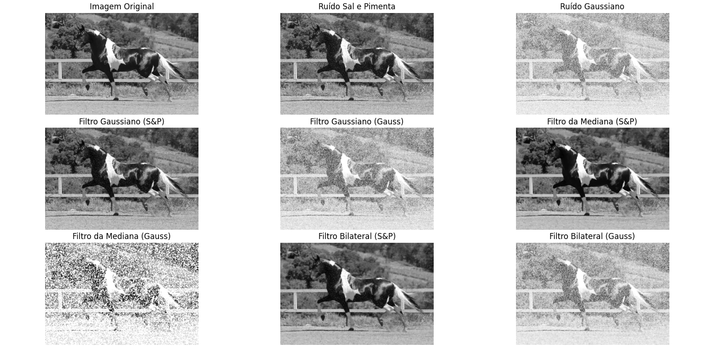

# Computação Gráfica e Processamento de Imagens

## Processamento Digital de Imagens - Unidade 4, seção 4.3

## Descrição

Este projeto visa avalisar a eficácia de diferentes filtros de suavização na remoção de ruídos em imagens. Foi utilizado uma imagem em escala de cinza e então foi aplicado ruídos do tipo Gaussiano e Sal & Pimenta. Para o tratamento desses ruídos utilizei os filtros Guassiano, de mediana e bilateral. Com isso, observei o impacto de cada filtro na qualidade da imagem e analisamos qual foi o mais eficaz para cada tipo de ruído. Todo o código está disponível neste repositório para consulta.

### 1. Carregamento de Imagem

### 2. Aplicação dos Filtros e Ruídos

#### Tipos de Ruído
1. Ruído Sal e Pimenta: Introduz pixels aleatoriamente em preto e branco, gerando pontos brilhantes e escuros que simulam interferências típicas de ruído impulsivo.
2. Ruído Gaussiano: Adiciona variações de intensidade a todos pixels da imagem de acordo com uma distribuição Gaussiana, criando um aspecto granular.

#### Filtros Aplicados
1. Filtro Gaussiano (média): aplica uma média ponderada dos pixels vizinhos, suavizando a imagem. Esse filtro é eficaz na redução de ruídos com um efeito de desfoque.
2. Filtro de Mediana: substitui cada pixel pela mediana de seus vizinhos, sendo eficaz para a remoção de ruídos impulsivos, como o Sal & Pimenta, mantendo melhor as bordas. 
3. Filtro Bilateral: realiza uma suavização espacial ao mesmo tempo que preserva as bordas, sendo útil para reduzir sem comprometer os detalhes da imagem.

### 3. Análise dos Resultados
- **Ruído Sal e Pimenta:**
    - **Filtro Gaussiano:** Suavizou o ruído, mas resultou em um leve desfoque nas bordas da imagem. Não foi tão eficaz na remoção completa dos pontos de ruído.
    - Filtro de Mediana: Removeu o ruído Sal e Pimenta de maneira eficaz, preservando bem as bordas e oferecendo uma imagem limpa.
    - **Filtro Bilateral:** Suavizou o ruído mantendo o contorno dos objetos, mas com menos eficácia na remoção completa do Sal e Pimenta em comparação com o filtro de Mediana.
- **Ruído Gaussiano:**
    - Filtro Gaussiano: Reduziu consideravelmente o ruído sem desfoque excessivo, proporcionando uma boa suavização da imagem.
    - Filtro de Mediana: Reduziu o ruído, mas com menos eficácia do que o Filtro Gaussiano, pois não é tão adequado para ruídos distribuídos.
    - Filtro Bilateral: Suavizou o ruído e manteve as bordas, sendo uma opção interessante para redução de ruído Gaussiano sem comprometer os detalhes.

 

**Qual filtro foi mais eficaz para suavizar a imagem em cada stipo de ruído?**

- **Para o Ruído Sal e Pimenta:** O Filtro de Mediana foi o mais eficaz, removendo os pontos de ruído sem comprometer as bordas e detalhes da imagem.
- **Para o Ruído Gaussiano:** O Filtro Gaussiano apresentou melhor desempenho ao reduzir o ruído de forma suave e uniforme, sem distorcer as bordas.

**Quais situações podem exigir o uso de cada tipo de filtro em um projeto real?**
    - **Filtro Gaussiano:** Ideal para casos em que o ruído é distribuído de forma granular (como o ruído Gaussiano). Utilizado em aplicações médicas e de visão computacional que requerem suavização sem muita definição de bordas.
    - **Filtro de Mediana:** Indicado para imagens com ruídos impulsivos, como o Sal e Pimenta. É amplamente utilizado em processamento de fotos digitais onde é preciso remover ruídos pontuais sem perda de detalhes.
    - **Filtro Bilateral:** Útil em situações que demandam suavização sem perda de detalhes finos e contornos, como em realce de detalhes em imagens de alta resolução e fotografias que exigem preservação das bordas.

